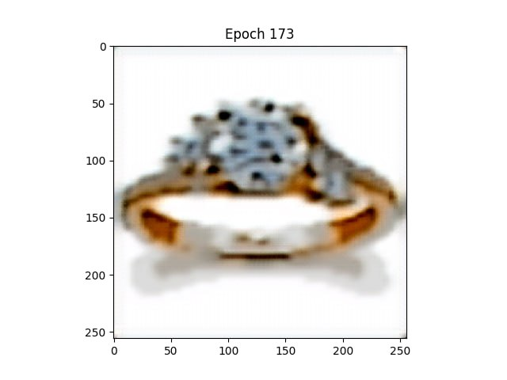

## Pix2Pix Implementation

This repository is my personal implementation of the VQ-VAE model, which stands for Vector-Quantized Variational AutoEncoder. The principle of this model is based on Vector Quantization. The input is encoded using an Encoder to a low-dimensional space, then quantized using VQ, and finally decoded back to a high-dimensional space.

## Getting Started

Follow these steps to use this implementation:

### Prerequisites

Ensure you have Python installed on your system. This code is compatible with Python 3.6 and newer versions.

### Dataset

For training and testing the VQ-VAE model, you'll need a dataset. Please note that the Pix2Pix dataset link provided below is just an example, and you should replace it with the actual VQ-VAE dataset link:

[VQ-VAE Dataset](https://www.kaggle.com/datasets/vikramtiwari/pix2pix-dataset)

After downloading, place the dataset in an appropriate directory within your project structure, such as `./data`.

### Installation

1. **Clone the repository** to your local machine:

    ```
    git clone https://github.com/yourusername/VQ-VAE.git
    ```

2. **Install the required dependencies**. It's recommended to create and use a virtual environment:

    ```
    python -m venv venv
    source venv/bin/activate  # On Windows use `venv\Scripts\activate`
    pip install -r requirements.txt
    ```

3. **Training the model**

    To run the model training, execute the following command from the root directory of the project:

    ```
    python train.py --root_dir <root_dir> --batch_size <batch_size> --epochs <epochs> --num_workers <num_workers> --device <device>
    ```
    **Note:** If you want to train on a dataset structured with subfolders, first run `collect.py` from the scripts directory. This script will collect all images into one big folder. For example, if your dataset structure is like this:
    ```
    --folder
        --subfolder1
        --subfolder2
    ```
    Otherwise, you can use `torchvision.datasets.ImageFolder`.

4. **Visualizing**


    To visualize the generated images, you can use the `generate.py` script:
    
    ```
    python generate.py --model_path <path_to_trained_model> --num_outputs <num_outputs> --device <device>
    ```

    Below is an example of a generated image at epoch 173:

    

   To visualize the generated images, you can use the `generate.py` script:
    ```
    python generate.py --model_path <model_path>
    ```
